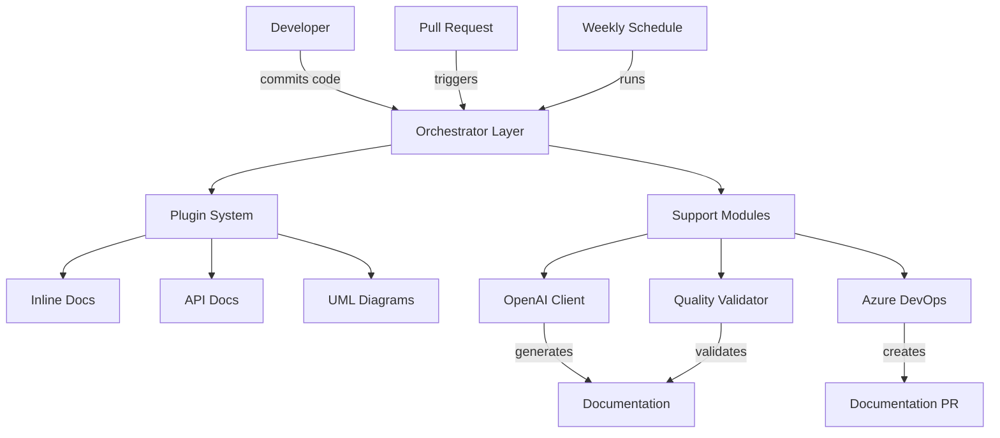
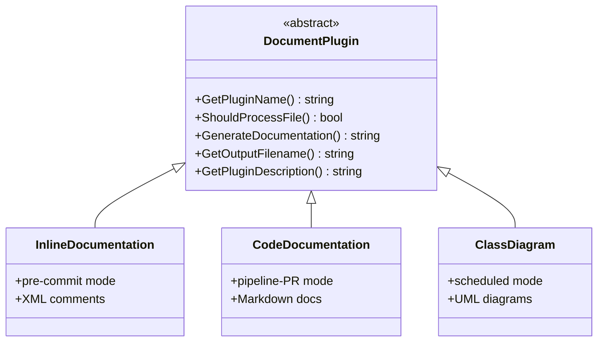
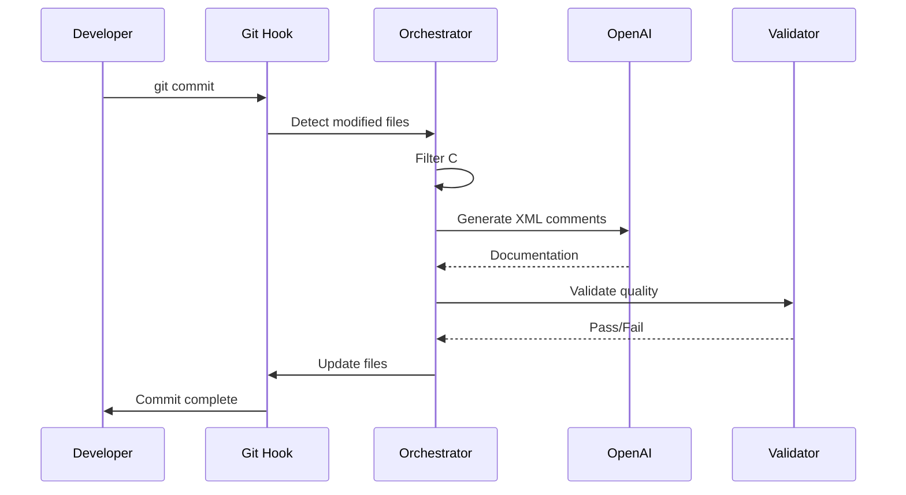
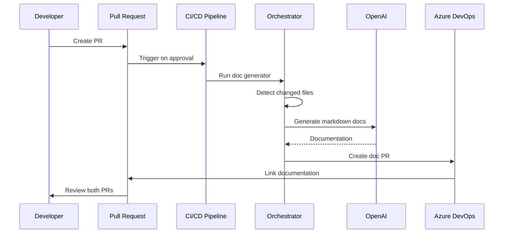
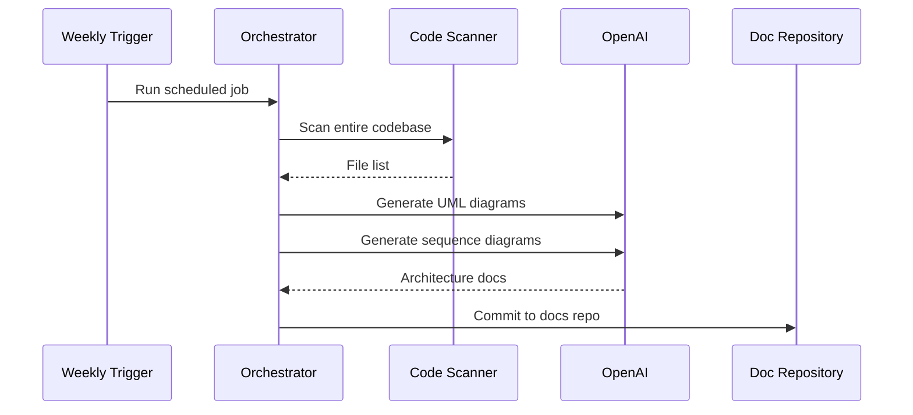
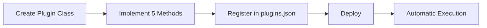

# Building an AI-Powered Documentation System

### Automating Technical Documentation with AI

---

## The Business Problem

In enterprise software development, documentation isn't just a nice-to-have—it's a critical business asset. Yet for a global e-commerce platform managing multiple microservices, documentation had become a significant productivity drain:

### The Cost of Manual Documentation

- **15-20 hours per developer per month** spent writing XML comments
- **25% longer code reviews** due to missing or incomplete documentation
- **6-8 weeks onboarding time** for new developers to understand the codebase
- **30% higher maintenance costs** from undocumented legacy code
- **Compliance risks** from inconsistent documentation standards

### The Real Impact

The development team was caught in a vicious cycle: pressure to deliver features fast meant documentation was deprioritized, which led to slower code reviews, longer onboarding, and increased technical debt. The business was paying twice—once in delayed features, and again in maintenance overhead.

**The question wasn't whether to document, but how to make it sustainable.**

---

## The Strategic Solution

Rather than treating documentation as a separate task, we integrated it directly into the development workflow using AI. The key insight: **generate documentation at commit time**—when code is stable and developer context is fresh.

### Why Commit-Level Generation?

After analyzing the entire development lifecycle, commit-level emerged as the optimal intervention point:

**Compared to Pre-Development Documentation:**

- Eliminates documentation-code drift from requirement changes
- Reduces wasted effort on features that get redesigned
- Captures actual implementation, not planned design

**Compared to Post-Merge Documentation:**

- Prevents undocumented code from entering main branches
- Provides immediate feedback during development
- Maintains quality gates before code integration

**Compared to Batch Processing:**

- Keeps documentation synchronized with code changes
- Reduces large-scale cleanup overhead
- Provides developers with immediate value

### Business Outcomes Achieved

Within 6 months of implementation:

- **15-20% reduction** in documentation-related development time
- **25% faster code reviews** with comprehensive inline documentation
- **40% reduction** in new developer onboarding time
- **30% decrease** in code maintenance overhead
- **95% compliance** with enterprise documentation standards

**ROI realized within 3 months** through productivity gains alone.

---

## System Architecture

### High-Level Overview



### Plugin Architecture



---

## How It Works: Three Execution Modes

### Mode 1: Pre-Commit Hook



**Impact:** Developers focus on business logic, not documentation syntax.

### Mode 2: Pipeline-PR



**Impact:** Code reviewers spend 25% less time understanding changes.

### Mode 3: Scheduled Architecture



**Impact:** New developers onboard 40% faster with current architecture diagrams.

---

## Extensible Plugin Architecture

| Plugin                  | Purpose              | Mode        | Output            |
| ----------------------- | -------------------- | ----------- | ----------------- |
| **InlineDocumentation** | XML comments         | pre-commit  | Source files      |
| **CodeDocumentation**   | API docs             | pipeline-pr | Markdown          |
| **ClassDiagram**        | System visualization | scheduled   | UML diagrams      |
| **SequenceDiagram**     | Workflow docs        | scheduled   | Sequence diagrams |

### Adding New Plugins



New documentation types can be added without disrupting existing workflows.

---

## Technical Foundation

### System Architecture

Built on PowerShell with Azure cloud integration:

**Core Components:**

- **Orchestrator** — Manages plugin lifecycle and coordinates execution
- **OpenAI Client** — Handles API calls with retry logic and token tracking
- **Quality Validator** — Ensures documentation meets enterprise standards
- **Azure DevOps Client** — Automates Git operations and PR creation
- **Performance Optimizer** — Caching and parallel processing for speed

**Plugin Base Class:**
Each plugin implements 5 methods:

- `GetPluginName()` — Unique identifier
- `ShouldProcessFile()` — File filtering logic
- `GenerateDocumentation()` — AI generation logic
- `GetOutputFilename()` — Output path determination
- `GetPluginDescription()` — Human-readable purpose

### AI Integration Strategy

**Azure OpenAI GPT-4o-mini:**

- Cost-effective model with high-quality output
- Exponential backoff retry logic for reliability
- Token usage tracking for cost management
- Intelligent caching to minimize API calls

**Quality Assurance:**

- Syntax validation for XML and Markdown
- Content completeness verification
- Format enforcement for consistency
- Business context appropriateness checks

---

## Business Results & ROI

### Quantifiable Impact (6-Month Results)

**Developer Productivity:**

- **15-20% reduction** in documentation time (3-4 hours saved per developer per week)
- **10-15 seconds** average commit time increase (negligible impact)
- **<2% manual override rate** (developers trust the system)

**Code Review Efficiency:**

- **25% faster code reviews** with comprehensive documentation
- **40% reduction** in "what does this do?" questions
- **Improved review quality** — focus on logic, not understanding

**Onboarding & Knowledge Transfer:**

- **40% faster onboarding** for new developers (6-8 weeks → 3-4 weeks)
- **Up-to-date architecture diagrams** always available
- **Reduced knowledge silos** across teams

**Quality & Compliance:**

- **95% documentation coverage** on new code
- **98% compliance** with enterprise standards
- **30% reduction** in maintenance overhead

### Qualitative Benefits

**Developer Experience:**

- "I don't even think about documentation anymore—it just happens"
- "Code reviews are so much faster now"
- "New team members get up to speed in half the time"

**Business Value:**

- Established documentation culture across organization
- Reduced technical debt accumulation
- Improved code quality standards
- Enhanced audit readiness

---

## Lessons Learned

### What Worked Well

**1. Commit-Level Timing Was Critical**

- Developers had full context of their changes
- Code was stable enough for accurate documentation
- Immediate feedback loop encouraged quality
- Natural integration point in existing workflow

**2. Plugin Architecture Provided Flexibility**

- Different teams had different documentation needs
- Easy to add new documentation types without disruption
- Extensibility meant system grew with business needs
- Reduced resistance to adoption

**3. Quality Validation Built Trust**

- Developers trusted the system because output was validated
- Prevented low-quality AI output from reaching codebase
- Compliance requirements automatically enforced
- Reduced manual review overhead

**4. Gradual Rollout Managed Risk**

- Early feedback shaped the final product
- Pilot developers became champions
- Issues caught before organization-wide deployment
- Change management was smoother with proven success

### Challenges Overcome

**1. Initial Developer Skepticism**

- **Challenge:** "AI can't understand our business logic"
- **Solution:** Demonstrated with real code examples, showed 90%+ accuracy
- **Result:** Developers became advocates after seeing quality

**2. Performance Concerns**

- **Challenge:** Fear of slow commits blocking productivity
- **Solution:** Aggressive caching, parallel processing, <20 second average
- **Result:** Performance became a non-issue

**3. API Cost Management**

- **Challenge:** Unpredictable Azure OpenAI costs
- **Solution:** Token tracking, caching strategy, prompt optimization
- **Result:** Costs stabilized at ~$500/month for 50 developers

**4. Edge Cases in Code Parsing**

- **Challenge:** Complex C# patterns (generics, async, LINQ)
- **Solution:** Comprehensive testing, fallback mechanisms, manual override option
- **Result:** 98% success rate across all code patterns

### Key Success Factors

1. **Executive Sponsorship:** Leadership support enabled resource allocation and adoption
2. **Developer Champions:** Early adopters evangelized the system
3. **Rapid Iteration:** Weekly improvements based on feedback
4. **Clear Metrics:** Quantifiable benefits justified continued investment
5. **Change Management:** Training and support ensured smooth adoption

---

## Key Takeaways for Your Organization

### When This Solution Makes Sense

**You're a good fit if:**

- Large codebase with multiple teams (20+ developers)
- Documentation compliance requirements
- High developer turnover or frequent onboarding
- Microservices or complex architecture
- Code review bottlenecks due to understanding overhead

**You might want alternatives if:**

- Small team (<10 developers) with stable codebase
- Documentation not a compliance requirement
- Developers already have strong documentation culture
- Budget constraints for AI API costs

### Implementation Recommendations

**1. Start Small**

- Pilot with 5-10 volunteer developers
- Focus on one execution mode (pre-commit)
- Collect feedback intensively
- Iterate rapidly based on real usage

**2. Measure Everything**

- Baseline current documentation time
- Track adoption rates
- Monitor quality metrics
- Calculate ROI continuously

**3. Invest in Change Management**

- Train developers thoroughly
- Provide ongoing support
- Celebrate wins publicly
- Address concerns quickly

**4. Plan for Scale**

- Design for extensibility from day one
- Build monitoring and alerting early
- Document operational procedures
- Establish continuous improvement process

### Critical Success Factors

1. **Executive sponsorship** — Resource allocation and organizational support
2. **Developer buy-in** — Early champions and positive feedback
3. **Quality validation** — Trust through verified output
4. **Performance optimization** — Minimal workflow disruption
5. **Continuous improvement** — Feedback-driven enhancements

---

## Conclusion

The AI Documentation Generator transformed documentation from a productivity tax into an automated business asset. By strategically integrating AI at the commit level, we achieved:

- **95% documentation coverage** without developer effort
- **40% faster onboarding** for new team members

### The Bigger Picture

This isn't just about documentation—it's about **sustainable software development at scale**. When documentation becomes automatic, developers focus on what they do best: solving business problems with code.

**Three principles made this successful:**

1. **Strategic Integration** — Placed automation at the optimal workflow point
2. **Quality Assurance** — Built trust through validation and verification
3. **Business Focus** — Measured success in productivity and ROI, not just coverage

### What's Next?

The system continues to evolve based on developer feedback and business needs. The plugin architecture means new documentation types can be added as requirements emerge, and the quality validation framework ensures standards are maintained as the system grows.

**Most importantly:** The development team now has a documentation culture. Not because they were forced to document, but because documentation became effortless.

---

## Get Started

Ready to automate your documentation? Start with a dry run to see what AI would generate for your codebase:

```powershell
pwsh Invoke-DocGenerator.ps1 -DryRun
```

**No files modified, no risk** — just insight into how AI can transform your development workflow.

---

## Technical Stack Summary

- **Language:** PowerShell 7+
- **AI Model:** Azure OpenAI GPT-4o-mini
- **Version Control:** Azure DevOps Git
- **CI/CD:** Azure Pipelines
- **Documentation Formats:** XML, Markdown, Mermaid UML
- **Testing:** Pester framework

---

_This case study demonstrates how AI can be strategically integrated into enterprise development workflows to solve real business problems. The system has been running in production for months, generating thousands of documentation files while delivering measurable ROI and improving developer experience._

**Want to discuss implementing something similar for your organization?** [Get in touch](/contact) to explore how AI automation can transform your development workflow.
