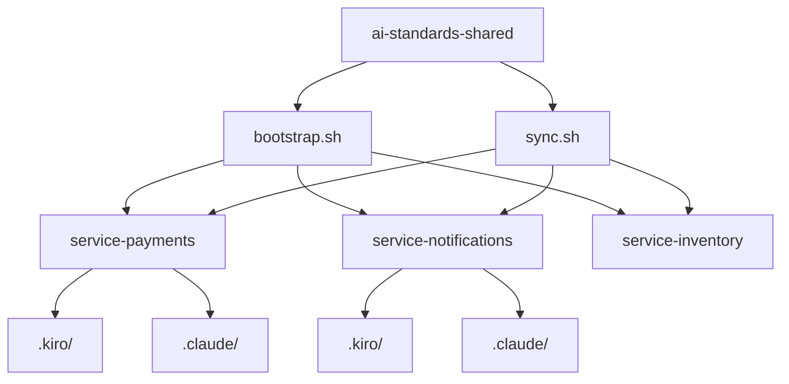
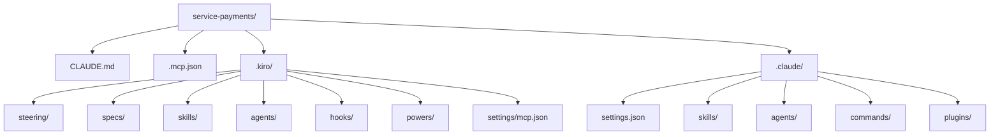
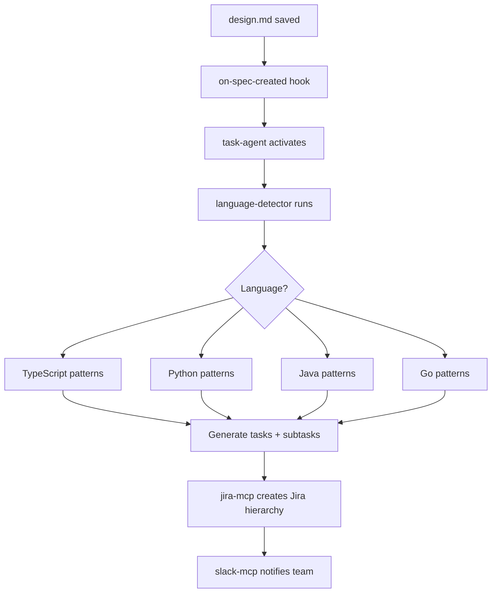
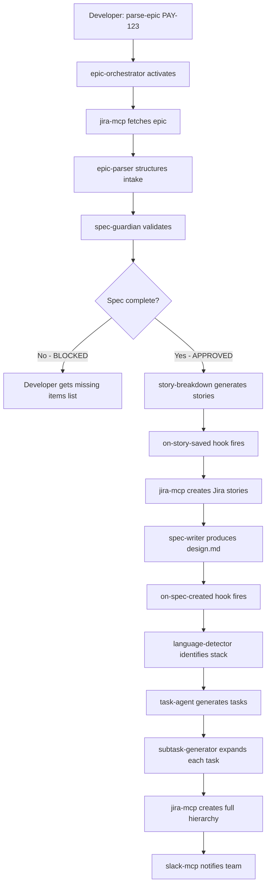

# Kiro CLI vs Claude Code: Building Team-Wide AI Development Standards

Your team is split. Half the developers swear by Claude Code — they live in the terminal and want raw capability without ceremony. The other half tried Kiro and never went back, because spec-driven development finally gave them a way to stop jumping straight to code before anyone agreed on what the requirements actually were. Both camps are right. And that's the problem.

When you're running 30+ microservices across a polyrepo, with Java teams, TypeScript teams, Python services, and Go infrastructure code all under one engineering org, "everyone just use what they like" becomes a fast track to fragmented AI workflows, inconsistent Jira hierarchies, and specs that look nothing alike between services. Three months in, your Epic-to-Subtask pipeline exists in three different forms, none of them talk to each other, and your PR review quality depends entirely on which tool the author happened to use that day.

The good news: you don't have to choose between Kiro and Claude Code. They're more compatible than most people realize — both support the open [agentskills.io](https://agentskills.io) standard, both can consume MCP connectors, and both can be pointed at the same skill definitions and agents. The work is in the wiring.

In this article, we'll build the complete directory structure, shared standards architecture, and Epic-to-Subtask automation pipeline that lets your developers use either tool while producing consistent, high-quality output across every service.

## What You'll Learn

- How Kiro and Claude Code differ in philosophy, workflow, and file structure
- The exact directory layout for both tools inside a service repo
- How to build a shared standards repo that feeds both tools
- Skills, agents, hooks, and MCP connectors that work identically in both
- The full Epic > Story > Task > Subtask pipeline, automated end-to-end
- A service-level override model that gives teams flexibility without chaos

## The Tool Divide: Why Both Tools Exist

Before getting into structure, it's worth understanding what each tool is actually trying to solve — because that shapes everything about how you integrate them.

Claude Code is deliberately minimal. You open a terminal, describe what you want, and the agent reads your codebase, edits files, runs commands, and iterates. There's no required workflow around it. No intermediate approval gates. The philosophy is maximum capability with minimal ceremony, which is exactly right for engineers who know what they want and just need help executing it quickly.

Kiro takes the opposite bet. When you give it a task, it doesn't immediately touch code. It generates a `requirements.md` using EARS notation, proposes system architecture in a `design.md`, and produces a dependency-ordered `tasks.md` before a single line of implementation is written. You review and approve each artifact. This is spec-driven development made mandatory — which sounds like overhead until you've watched a senior engineer and a junior engineer build completely different things from the same one-line ticket description.

The model choice also differs. Kiro runs on Claude Sonnet via AWS Bedrock. Claude Code runs on Claude Opus, which gives it an edge on complex multi-step reasoning. For architecture decisions and ambiguous problems, that gap is real.

Here's the thing neither tool's marketing material tells you directly: they share a common skill standard. The [agentskills.io](https://agentskills.io) open specification means a `SKILL.md` file written for Claude Code drops directly into Kiro's `skills/` directory and works. That single fact is what makes a unified team standard achievable.

## Architecture: The Three-Repo Model

Running both tools consistently across 30+ services requires one upstream source of truth. Everything flows from there.

```
Repository types:

ai-standards-shared/     ← Platform team owns this. All skills, agents,
                            hooks, MCP configs, and steering templates live here.
                            No domain-specific content.

service-{name}/          ← Each microservice (payments, notifications,
                            inventory, etc.). Receives a full copy of shared
                            standards on bootstrap. Teams add overrides locally.

~/.kiro/ and ~/.claude/  ← Developer machines only. Personal preferences,
                            tone settings, verbosity. Never shared standards.
```

The bootstrap script copies the full shared standards into a new service repo. The sync script propagates upstream updates while preserving anything inside a service's override zones. That last part is critical — we'll cover the override convention in detail later.



Each service repo ends up with both a `.kiro/` directory and a `.claude/` directory. Kiro users touch `.kiro/`. Claude Code users touch `.claude/`. The skills content inside both is identical — only the container differs.

## The Shared Standards Repo

This is the upstream. The platform or architecture team owns it. Developers don't push here directly — they submit PRs, the team reviews, and sync runs downstream.

```
ai-standards-shared/
├── README.md                            # How to bootstrap, sync, contribute
├── scripts/
│   ├── bootstrap.sh                     # Copies standards into new service repo
│   └── sync.sh                          # Merges upstream updates, preserves overrides
│
└── shared/
    ├── skills/
    │   ├── epic-parser/
    │   │   ├── SKILL.md                 # Core skill definition
    │   │   └── references/
    │   │       └── epic-schema.json     # Jira field mapping schema
    │   ├── story-breakdown/
    │   │   ├── SKILL.md
    │   │   └── references/
    │   │       └── story-schema.json    # INVEST criteria validation schema
    │   ├── task-generator/
    │   │   ├── SKILL.md
    │   │   └── references/
    │   │       └── task-schema.json     # Language-specific task templates
    │   ├── subtask-generator/
    │   │   ├── SKILL.md
    │   │   └── references/
    │   │       └── subtask-schema.json  # AC + DoD + test requirement schema
    │   ├── api-contract-validator/
    │   │   └── SKILL.md
    │   ├── spec-writer/
    │   │   └── SKILL.md
    │   ├── code-reviewer/
    │   │   └── SKILL.md
    │   └── language-detector/
    │       └── SKILL.md
    │
    ├── agents/
    │   ├── epic-orchestrator.md         # Claude Code format
    │   ├── epic-orchestrator.json       # Kiro format (same content)
    │   ├── story-agent.md
    │   ├── story-agent.json
    │   ├── task-agent.md
    │   ├── task-agent.json
    │   ├── pr-reviewer.md
    │   ├── pr-reviewer.json
    │   └── spec-guardian.md
    │   └── spec-guardian.json
    │
    ├── hooks/
    │   ├── on-spec-created.json         # Kiro hook format
    │   ├── on-spec-created.md           # Claude Code hook format
    │   ├── on-pr-opened.json
    │   ├── on-pr-opened.md
    │   ├── on-api-change.json
    │   ├── on-api-change.md
    │   └── on-story-saved.json
    │   └── on-story-saved.md
    │
    ├── mcp/
    │   ├── jira-mcp.json               # Jira connector (shared fields)
    │   ├── github-mcp.json             # GitHub connector
    │   └── slack-mcp.json              # Slack notifications
    │
    └── steering/
        ├── product.md                  # [PLACEHOLDER] Service purpose
        ├── tech.md                     # [PLACEHOLDER] Stack + frameworks
        ├── structure.md                # Folder layout, naming rules (inherited)
        ├── workflow.md                 # Epic > Story > Task process (inherited)
        └── jira-taxonomy.md            # Jira field standards, labels (inherited)
```

The `.md` / `.json` dual format for agents and hooks is intentional. You're shipping two representations of the same thing. Claude Code agents are Markdown system-prompt files. Kiro agents are JSON configs. The bootstrap script copies both into the appropriate locations in each service repo.

## Service Repo Structure: Side by Side

This is the core of the article. Here's what a service repo looks like after bootstrap — with both tool directories in place.



Let's break down each directory in detail for both tools.

### Memory and Context Files

The first thing both tools need is context about what this service actually is. Without it, you get generic output.

**Kiro** stores context in steering files under `.kiro/steering/`. Each file has a mode: `always` (loaded in every interaction), `fileMatch` (loaded when matching files are active), or `manual` (invoked explicitly). The `product.md` and `tech.md` files are flagged `always`. The others load conditionally.

**Claude Code** stores context in `CLAUDE.md` at the repo root, with sections for each concern. It cascades — a `CLAUDE.md` in a subdirectory gets picked up automatically when you're working in that directory.

```
# Kiro steering directory
.kiro/steering/
├── product.md          ← OVERRIDE: Service purpose, bounded context, deps
├── tech.md             ← OVERRIDE: Language, frameworks, DB, messaging
├── structure.md        ← INHERITED: Folder layout, naming conventions
├── workflow.md         ← INHERITED: Epic > Story > Task > Subtask process
└── jira-taxonomy.md    ← OVERRIDE: Project key (PAY), labels, components
```

```markdown
## <!-- .kiro/steering/product.md (service team fills this section) -->

## mode: always

# Service: payments

## Purpose

Handles all payment processing for the platform. Owns the payment lifecycle
from initiation through settlement. Downstream consumers: order-service,
notification-service. Upstream dependencies: fraud-detection, currency-service.

## Bounded Context

This service owns: payment intents, payment methods, settlement records.
It does NOT own: order state (order-service), user billing profiles (accounts-service).

## Key Constraints

PCI-DSS scope. All card data proxied through Stripe. No raw PAN storage.
```

```markdown
<!-- CLAUDE.md root section (equivalent for Claude Code users) -->

## Service: payments

### Purpose

Handles payment processing. Owns payment lifecycle from initiation through settlement.
Downstream: order-service, notification-service. Upstream: fraud-detection, currency-service.

### Bounded Context

Owns: payment intents, payment methods, settlement records.
Does NOT own: order state, user billing profiles.

### Constraints

PCI-DSS scope. All card data proxied through Stripe. No raw PAN storage.

### Tech Stack

Runtime: Node.js 22 / TypeScript 5.4
Framework: Fastify 4.x
DB: PostgreSQL 16 via pgx (connection pool: 40)
Messaging: Kafka 3.7 (topics: payment.initiated, payment.settled, payment.failed)
Infra: AWS ECS Fargate, deployed via GitHub Actions
```

### Skills: The Shared Intelligence

Skills are the most important shared component. A skill is a `SKILL.md` file that teaches the AI a specific capability — how to parse a Jira epic, how to generate tasks for a TypeScript service, how to validate an OpenAPI contract. Both tools read the same file format.

Here's the full skill set for the Epic-to-Subtask pipeline:

| Skill                  | Override Fields                                              | When It Activates               |
| ---------------------- | ------------------------------------------------------------ | ------------------------------- |
| epic-parser            | epic-label-prefix, custom-field-mappings, default-components | Manual or on-epic-received hook |
| story-breakdown        | story-point-scale, persona-definitions, ac-template          | After epic-parser completes     |
| task-generator         | task-size-threshold, preferred-patterns, excluded-frameworks | on-spec-created hook            |
| subtask-generator      | dod-checklist, test-coverage-threshold, subtask-max-hours    | After task-generator            |
| api-contract-validator | contract-path, api-style, breaking-change-policy             | on-api-change hook              |
| spec-writer            | doc-template, architecture-style, diagram-format             | After story-breakdown           |
| code-reviewer          | review-checklist, security-rules, coverage-minimum           | on-pr-opened hook               |
| language-detector      | none — reads package.json, pom.xml, go.mod, pyproject.toml   | Always-on                       |

The `language-detector` skill is particularly important in a polyglot environment. It reads your service's dependency manifest, identifies the primary language, and activates language-specific overlays in `task-generator`. A TypeScript service gets Fastify/Prisma patterns. A Java service gets Spring Boot / Hibernate patterns. A Go service gets standard library idioms. The task output looks appropriate for the codebase without any manual configuration.

Here's what the `epic-parser` SKILL.md looks like:

```markdown
<!-- shared/skills/epic-parser/SKILL.md -->

# skill: epic-parser

# version: 2.1

# compatible: kiro>=1.0, claude-code>=1.5

# standard: agentskills.io/v1

## Purpose

Parse a Jira epic into a structured specification document. Extract goals,
scope boundaries, constraints, success metrics, and stakeholder requirements
from the epic and its linked documents. Output a requirements.md that is
complete enough for spec-guardian to approve.

## Inputs

- Jira epic key (e.g. PAY-123) accessed via jira-mcp
- Any linked Confluence pages or attached documents
- Service context from steering/product.md

## Instructions

1. Fetch the epic via jira-mcp using the provided epic key
2. Extract: summary, description, acceptance criteria, linked stories, labels,
   components, priority, target release, reporter, assigned team
3. Identify scope boundaries — what IS included and what is explicitly excluded
4. Map Jira custom fields using the service's custom-field-mappings override
5. Structure the output as requirements.md using the template in references/

## Output Format

Write requirements.md to specs/{feature-slug}/requirements.md

The file must contain:

- ## Goals: 3-5 measurable goals with success criteria
- ## Scope: In-scope and explicitly out-of-scope items
- ## Constraints: Technical, regulatory, timeline constraints
- ## Acceptance Criteria: EARS-format ACs (When X, the system shall Y)
- ## Dependencies: Upstream services, APIs, data sources required
- ## Open Questions: Anything that blocks story breakdown

## References

See references/epic-schema.json for Jira field mappings.

<!-- ===== OVERRIDE ZONE START ===== -->

## Service Overrides

# epic-label-prefix: "" # default: "" (matches all epics)

# custom-field-mappings: {} # default: {} (standard Jira fields only)

# default-components: [] # default: [] (no automatic component tagging)

<!-- ===== OVERRIDE ZONE END ===== -->
```

The OVERRIDE ZONE is the key to the inheritance model. The bootstrap and sync scripts use those comment markers as boundaries. Anything outside them gets updated when upstream changes. Anything inside is owned by the service team forever.

For a payments service, the override looks like this:

```markdown
<!-- ===== OVERRIDE ZONE START ===== -->

## Service Overrides

epic-label-prefix: "PAY-"
custom-field-mappings:
pci-scope: "customfield_10234"
payment-method: "customfield_10235"
regulatory-requirement: "customfield_10236"
default-components: ["payments-core", "settlement"]

<!-- ===== OVERRIDE ZONE END ===== -->
```

Same skill. Same intelligence. Service-specific field mapping.

### Agents: Coordinating the Pipeline

Five agents run the workflow. They're the same logic in two formats — Kiro gets JSON, Claude Code gets Markdown.

```json
// .kiro/agents/epic-orchestrator.json
{
  "name": "epic-orchestrator",
  "description": "Coordinates the full Epic to spec to Jira tasks pipeline",
  "model": "claude-sonnet-4-20250514",
  "tools": ["jira-mcp", "github-mcp", "slack-mcp"],
  "skills": ["epic-parser", "story-breakdown", "spec-writer", "language-detector"],
  "instructions": "You orchestrate the full Epic intake workflow. When given a Jira epic key: 1) Use epic-parser skill to fetch and structure the epic. 2) Call spec-guardian to validate completeness before proceeding. 3) Use story-breakdown skill to generate user stories. 4) Use spec-writer to produce requirements.md and design.md. 5) Sync all artifacts to Jira via jira-mcp. 6) Notify the team channel via slack-mcp. Do not generate tasks — that is task-agent's responsibility, triggered by the on-spec-created hook.",
  "hooks": {
    "onComplete": "notify-slack"
  }
}
```

```markdown
<!-- .claude/agents/epic-orchestrator.md -->

# Agent: epic-orchestrator

You coordinate the full Epic intake workflow. When given a Jira epic key:

1. Use the epic-parser skill to fetch and structure the epic from Jira
2. Call spec-guardian to validate completeness — do not proceed if it blocks
3. Use story-breakdown skill to generate INVEST-compliant user stories
4. Use spec-writer to produce requirements.md and design.md
5. Sync all artifacts to Jira via jira-mcp
6. Notify the team Slack channel via slack-mcp when complete

Do not generate technical tasks. That is task-agent's responsibility,
triggered automatically by the on-spec-created hook when design.md is saved.

## Tools Available

- jira-mcp: Read/write Jira epics, stories, tasks
- github-mcp: Read PR context if relevant
- slack-mcp: Send completion notifications

## Skills to Apply

- epic-parser, story-breakdown, spec-writer, language-detector
```

The `spec-guardian` agent is worth highlighting specifically. It's the quality gate. Before `task-agent` runs, `spec-guardian` validates that `requirements.md` meets the completeness threshold: all required sections present, at least 3 EARS-format acceptance criteria, no unresolved open questions blocking story breakdown. If it fails, the pipeline stops and the developer gets a structured list of what's missing. This alone catches the most common failure mode — generating tasks from underspecified requirements.

```json
// .kiro/agents/spec-guardian.json
{
  "name": "spec-guardian",
  "description": "Validates spec completeness before task generation proceeds",
  "instructions": "Review the provided requirements.md against the completeness checklist. A spec is COMPLETE when: (1) All 6 required sections are present and non-empty, (2) At minimum 3 acceptance criteria are written in EARS format (When X, the system shall Y), (3) The Scope section has explicit out-of-scope items, (4) No Open Questions are marked as blocking. If INCOMPLETE: respond with BLOCKED and a numbered list of what is missing. If COMPLETE: respond with APPROVED and a one-sentence summary of what will be built.",
  "model": "claude-sonnet-4-20250514",
  "tools": []
}
```

### Hooks: Automation That Connects It All

Hooks are where the workflow becomes self-driving. In Kiro, they're JSON files with natural language instructions that fire on file system events. In Claude Code, they're shell scripts registered in `.claude/settings.json` that fire on tool lifecycle events.



```json
// .kiro/hooks/on-spec-created.json
{
  "name": "on-spec-created",
  "trigger": {
    "type": "onSave",
    "patterns": ["specs/**/*.md"],
    "files": ["design.md"]
  },
  "instructions": "When a design.md file is saved inside specs/, activate task-agent. Pass it the feature slug derived from the file path. task-agent should read both requirements.md and design.md from the same feature directory, run language-detector to identify the service language, generate technical tasks and subtasks, and create the full task hierarchy in Jira via jira-mcp.",
  "agent": "task-agent"
}
```

```json
// .claude/settings.json (hooks section)
{
  "hooks": {
    "PostToolUse": [
      {
        "matcher": "Write",
        "hooks": [
          {
            "type": "command",
            "command": "bash .claude/hooks/on-spec-created.sh",
            "condition": "echo $CLAUDE_TOOL_INPUT | jq -r '.path' | grep -q 'specs/.*/design.md'"
          }
        ]
      },
      {
        "matcher": "Write",
        "hooks": [
          {
            "type": "command",
            "command": "bash .claude/hooks/on-story-saved.sh",
            "condition": "echo $CLAUDE_TOOL_INPUT | jq -r '.path' | grep -q 'specs/.*/requirements.md'"
          }
        ]
      }
    ]
  }
}
```

```bash
#!/bin/bash
# .claude/hooks/on-spec-created.sh
# Fired by PostToolUse when design.md is written inside specs/

TOOL_INPUT=$(echo "$1")
FILE_PATH=$(echo "$TOOL_INPUT" | jq -r '.path' 2>/dev/null)

# Only proceed if this is a design.md save
if [[ "$FILE_PATH" != *"specs/"*"/design.md" ]]; then
  exit 0
fi

# Extract feature slug from path: specs/payment-refunds/design.md -> payment-refunds
FEATURE_SLUG=$(echo "$FILE_PATH" | sed 's|specs/||' | sed 's|/design.md||')

echo "Spec created for feature: $FEATURE_SLUG. Triggering task generation..."

# Run task-agent with the feature context
claude --agent task-agent \
  "Generate tasks and subtasks for feature: $FEATURE_SLUG.
   Read specs/$FEATURE_SLUG/requirements.md and design.md.
   Run language-detector first, then apply appropriate task templates.
   Create the full task hierarchy in Jira and output specs/$FEATURE_SLUG/tasks.md"
```

The `on-api-change` hook is particularly valuable in a polyrepo with 30+ services sharing contracts. When any `openapi.yaml` or `asyncapi.yaml` is modified, it triggers `api-contract-validator` before the change can be pushed. Breaking changes fail the pipeline.

```json
// .kiro/hooks/on-api-change.json
{
  "name": "on-api-change",
  "trigger": {
    "type": "onSave",
    "patterns": ["**/openapi.yaml", "**/openapi.json", "**/asyncapi.yaml"]
  },
  "instructions": "When an API schema file is saved, run api-contract-validator skill against it. Compare with the previous committed version to detect breaking changes. A breaking change includes: removing an endpoint, removing a required field, changing a field type, changing an HTTP method. If breaking changes are detected, output a BREAKING CHANGE report and prevent the file save from being committed. If non-breaking, output a COMPATIBLE report listing what changed.",
  "agent": "spec-guardian",
  "onFailure": "block"
}
```

### MCP Connectors: The Jira Integration

MCP (Model Context Protocol) is what gives both tools live access to your systems. Kiro stores its MCP config at `.kiro/settings/mcp.json`. Claude Code uses `.mcp.json` at the repo root. Both reference the same three servers.

```json
// .kiro/settings/mcp.json (and .mcp.json for Claude Code)
{
  "mcpServers": {
    "jira-mcp": {
      "command": "npx",
      "args": ["-y", "@modelcontextprotocol/server-jira"],
      "env": {
        "JIRA_BASE_URL": "${JIRA_BASE_URL}",
        "JIRA_EMAIL": "${JIRA_EMAIL}",
        "JIRA_API_TOKEN": "${JIRA_API_TOKEN}"
      }
    },
    "github-mcp": {
      "command": "npx",
      "args": ["-y", "@modelcontextprotocol/server-github"],
      "env": {
        "GITHUB_PERSONAL_ACCESS_TOKEN": "${GITHUB_TOKEN}"
      }
    },
    "slack-mcp": {
      "command": "npx",
      "args": ["-y", "@modelcontextprotocol/server-slack"],
      "env": {
        "SLACK_BOT_TOKEN": "${SLACK_BOT_TOKEN}",
        "SLACK_TEAM_ID": "${SLACK_TEAM_ID}"
      }
    }
  }
}
```

The service-level override for Jira MCP lives in the `jira-taxonomy.md` steering file. Each service sets its own project key, custom fields, components, and labels. The MCP config itself is inherited; the service-specific targeting happens through steering.

```markdown
## <!-- .kiro/steering/jira-taxonomy.md (payments service) -->

## mode: always

# Jira Taxonomy: payments

## Project

Key: PAY
Board ID: 142
Issue types in use: Epic, Story, Task, Sub-task

## Labels (always apply to generated issues)

- service:payments
- team:payments-squad
- ai-generated (applied to all AI-created issues for audit trail)

## Components

- payments-core
- settlement
- payment-methods
- webhooks

## Custom Fields

- PCI scope: customfield_10234 (values: in-scope, out-of-scope, not-applicable)
- Payment method: customfield_10235 (values: card, bank-transfer, wallet, crypto)
- Regulatory requirement: customfield_10236 (free text)

## Story Point Scale

Fibonacci: 1, 2, 3, 5, 8, 13
Max story size before split: 8 points
```

### Kiro-Specific: Powers

Kiro has a concept Claude Code doesn't: Powers. A Power bundles an MCP server with a `POWER.md` steering file that activates automatically when the Power's MCP tools are used. It's essentially a plugin that brings its own context.

```markdown
<!-- .kiro/powers/jira-power/POWER.md -->

# power: jira-power

# activates-with: jira-mcp

When using jira-mcp tools, apply these conventions automatically:

1. Always add the "ai-generated" label to any issue you create
2. Always link created issues to their parent epic using Jira's link type "is part of"
3. Use the project key from jira-taxonomy.md steering file
4. Set the reporter to the authenticated user (from JIRA_EMAIL env var)
5. When creating sub-tasks, set the parent to the task, not the story

Story creation format:

- Summary: "[STORY] {verb} {object} so that {outcome}"
- Description: Full "As a {persona}, I want {goal} so that {outcome}" + AC list

Task creation format:

- Summary: "[TASK] {specific technical action}"
- Description: Technical implementation details + definition of done
```

### Claude Code-Specific: Commands and Plugins

Claude Code's equivalent of Kiro's Power is a combination of slash commands and plugins. Commands are Markdown files that define a reusable prompt invocation. Plugins bundle multiple components together.

```markdown
<!-- .claude/commands/parse-epic.md -->

# Command: /parse-epic

Parse a Jira epic and generate structured specification documents.

## Usage

/parse-epic PROJ-123

## What This Does

1. Fetches epic PROJ-123 from Jira using jira-mcp
2. Runs epic-parser skill to structure the intake
3. Calls spec-guardian to validate before proceeding
4. Generates specs/{feature-slug}/requirements.md
5. Reports what was created and any open questions found

## Arguments

- $ARGUMENTS: The Jira epic key (required)

Activate epic-orchestrator agent with the provided epic key: $ARGUMENTS
```

```markdown
<!-- .claude/commands/generate-tasks.md -->

# Command: /generate-tasks

Generate technical tasks and subtasks from an approved spec.

## Usage

/generate-tasks {feature-slug}

## What This Does

1. Reads specs/{feature-slug}/requirements.md and design.md
2. Runs language-detector to identify service language
3. Runs task-generator with language-appropriate patterns
4. Runs subtask-generator for each task
5. Creates the full hierarchy in Jira
6. Writes specs/{feature-slug}/tasks.md

## Arguments

- $ARGUMENTS: Feature slug matching the specs/ directory name

Activate task-agent with feature: $ARGUMENTS
```

## The Full Epic-to-Subtask Pipeline

With all the components in place, here's the complete workflow from Jira epic to implementation-ready subtasks.



In practice, a developer running this for the first time sees something like this sequence:

```bash
# Using Claude Code
/parse-epic PAY-456

# Output:
# Fetching PAY-456: "Implement payment method management API"
# epic-parser: Structured 1 epic, 6 acceptance criteria, 3 constraints
# spec-guardian: APPROVED — "REST API for CRUD operations on saved payment methods"
# story-breakdown: Generated 4 user stories
# spec-writer: Written to specs/payment-method-management/
# jira-mcp: Created PAY-457, PAY-458, PAY-459, PAY-460 linked to PAY-456
# slack-mcp: Notified #payments-squad

# [design.md save triggers on-spec-created hook automatically]
# task-agent: language-detector identified TypeScript + Fastify
# task-agent: Generated 12 tasks across 4 stories
# subtask-generator: Expanded to 34 subtasks with AC and DoD
# jira-mcp: Created full hierarchy in PAY project
# tasks.md written to specs/payment-method-management/tasks.md
```

The same sequence in Kiro looks identical from a Jira perspective. The developer just triggers it through Kiro's UI instead of a terminal command. The output artifacts, Jira issues, and Slack notifications are indistinguishable.

## The Override Convention in Practice

Every file that a service team might need to customize follows this structure:

```markdown
# skill: task-generator

# version: 1.4

# inherited-from: ai-standards-shared

# last-synced: 2026-02-28

## Purpose

[inherited content — do not edit]

## Instructions

[inherited content — do not edit]

## References

[inherited content — do not edit]

<!-- ===== OVERRIDE ZONE START ===== -->

## Service Overrides

# Modify only this section. sync.sh preserves everything between the markers.

# To reset a field to default, remove the line entirely.

task-size-threshold: 4h # default: 8h (payments tasks are smaller, more atomic)
preferred-patterns: repository,cqrs,event-sourcing # default: layered # reason: payment state is audit-critical, event-sourcing required
excluded-frameworks: [] # default: []
max-tasks-per-story: 4 # default: 6

<!-- ===== OVERRIDE ZONE END ===== -->
```

The `sync.sh` script implementation:

```bash
#!/bin/bash
# scripts/sync.sh
# Updates shared standards in a service repo while preserving all override zones.

SERVICE_REPO="${1:?Usage: sync.sh <path-to-service-repo>}"
SHARED_DIR="$(dirname "$0")/../shared"

echo "Syncing standards to: $SERVICE_REPO"

for skill_dir in "$SHARED_DIR"/skills/*/; do
  skill_name=$(basename "$skill_dir")

  # Determine target path for Kiro and Claude Code
  kiro_target="$SERVICE_REPO/.kiro/skills/$skill_name"
  claude_target="$SERVICE_REPO/.claude/skills/$skill_name"

  for target in "$kiro_target" "$claude_target"; do
    target_skill="$target/SKILL.md"

    if [[ ! -f "$target_skill" ]]; then
      # New skill: copy wholesale
      mkdir -p "$target"
      cp -r "$skill_dir"/* "$target/"
      echo "  Added new skill: $skill_name to $target"
      continue
    fi

    # Extract existing override zone content
    override_content=$(sed -n '/OVERRIDE ZONE START/,/OVERRIDE ZONE END/p' "$target_skill")

    # Copy updated skill (this overwrites everything)
    cp "$skill_dir/SKILL.md" "$target_skill"

    # Re-inject the service's override zone
    # Replace the empty override zone in the fresh copy with the saved one
    python3 - <<PYEOF
import re

with open('$target_skill', 'r') as f:
    content = f.read()

override = """$override_content"""

# Replace the template override zone with the service's preserved overrides
content = re.sub(
    r'<!-- ===== OVERRIDE ZONE START ===== -->.*?<!-- ===== OVERRIDE ZONE END ===== -->',
    override,
    content,
    flags=re.DOTALL
)

with open('$target_skill', 'w') as f:
    f.write(content)
PYEOF

    echo "  Updated: $skill_name (overrides preserved)"
  done
done

echo "Sync complete."
```

## Global Scope: What Goes on Developer Machines

This is the most important boundary to enforce by convention, because it can't be enforced technically. Global scope — `~/.kiro/` and `~/.claude/` — is for personal preferences only.

```
# What SHOULD be in ~/.kiro/steering/personal-prefs.md
---
mode: always
---
I prefer concise responses without preamble.
When writing TypeScript, prefer functional patterns over class-based.
When reviewing code, focus on edge cases first, then style.
My timezone is UTC+1. Use EU date formats.
```

```
# What should NEVER be in ~/.kiro/ or ~/.claude/
- Shared skill definitions
- Team agents
- MCP server configs with team credentials
- Jira taxonomy files
- Any standards meant for more than one person
```

If a developer puts shared standards in global scope, they'll get behavior that isn't reproducible by their teammates. The spec guardian on their machine will pass things another developer's would block. This isn't hypothetical — it's the failure mode that makes team AI standards fall apart silently.

Document this in your README and enforce it in onboarding. It's a convention, not a technical constraint.

## Performance Reality: What to Expect

Spec generation through this pipeline adds time upfront but reduces the expensive downstream rework that comes from building the wrong thing.

In production teams running this pattern, the rough numbers look like this:

- Epic parsing and story generation: 45-90 seconds per epic (depends on epic size and Jira response time)
- Task and subtask generation for 4 stories: 60-120 seconds
- Total pipeline for a medium epic: 2-4 minutes from trigger to full Jira hierarchy

Compare that to a manual process where a tech lead spends 2-3 hours writing stories and tasks for a medium epic, then another hour in review fixing issues with scope and acceptance criteria. The pipeline is faster in total time even if the AI runtime feels slow.

Where the pipeline has overhead: the spec-guardian validation step. When developers submit underspecified epics, the pipeline fails and they have to fix the epic in Jira before trying again. This is intentional. The friction is the feature. Bad epics generate bad tasks, and the cost of discovering a bad task at implementation time is 10x the cost of fixing the epic before story breakdown starts.

## Common Problems and How to Debug Them

**Override zone lost after sync**: The sync script uses Python regex to find the override zone markers. If a developer edited the markers — added spaces, changed the comment syntax — the regex won't match and the zone won't be preserved. Keep the markers exactly as defined. Consider a pre-sync validation that checks marker integrity.

**Language detector activating the wrong overlay**: This happens when a service has multiple dependency manifests — say, a Go backend and a TypeScript frontend monorepo. The detector reads the root-level manifest first. If the frontend `package.json` is at root and the Go code is in a subdirectory, it'll choose TypeScript. Fix by adding a `language-override` field in the tech.md steering file.

```markdown
<!-- .kiro/steering/tech.md override section -->

language-override: go

# Reason: package.json at root is for build tooling only.

# Primary service language is Go (see /cmd/ and /internal/)
```

**Jira MCP rate limiting**: The Jira Cloud API limits unauthenticated requests and applies stricter limits on certain endpoints. When generating large task hierarchies — 30+ subtasks — you'll hit rate limits. Add exponential backoff in your MCP config or batch task creation.

```json
// .kiro/settings/mcp.json
{
  "mcpServers": {
    "jira-mcp": {
      "command": "npx",
      "args": ["-y", "@modelcontextprotocol/server-jira"],
      "env": {
        "JIRA_BASE_URL": "${JIRA_BASE_URL}",
        "JIRA_EMAIL": "${JIRA_EMAIL}",
        "JIRA_API_TOKEN": "${JIRA_API_TOKEN}",
        "JIRA_RATE_LIMIT_DELAY_MS": "200",
        "JIRA_MAX_RETRIES": "3"
      }
    }
  }
}
```

**spec-guardian blocking everything**: If spec-guardian is too aggressive and blocking reasonable specs, check the completeness thresholds in the agent definition. The defaults work for large feature epics, but bug-fix epics and small improvements often don't need 6 full sections. Add a `epic-type` field in your override that relaxes requirements for `bug`, `improvement`, and `tech-debt` epic types.

**Kiro hooks not firing**: Kiro hook file patterns use glob syntax, but the match is relative to the `.kiro/` directory. A pattern of `specs/**/*.md` matches `specs/feature/design.md` relative to the repo root, not relative to `.kiro/`. If hooks aren't firing, check that your file paths match the pattern from the repo root.

## FAQ

### Can I use Kiro and Claude Code on the same repo at the same time?

Yes, and this is exactly the intended setup. Both `.kiro/` and `.claude/` directories coexist in the same service repo without conflict. When Alice opens the repo in Kiro, it reads `.kiro/`. When Bob clones it and uses Claude Code, it reads `.claude/`. The Jira issues they create, the specs they generate, and the code they produce all conform to the same shared standards because both tools point to equivalent skill definitions.

The one coordination point to watch: if both developers are working on the same feature simultaneously, they may both trigger spec generation for the same epic. The `on-spec-created` hook will fire twice and attempt to create duplicate Jira tasks. Guard against this by checking whether tasks already exist for the epic before creating new ones, or by using a feature flag in the spec file.

### How do we handle the agentskills.io compatibility between Kiro and Claude Code skills?

The agentskills.io standard defines a common `SKILL.md` format that both tools read. Both tools will look for a `SKILL.md` in the skill directory and process the structured sections: Purpose, Instructions, Inputs, Outputs, References, and the Override Zone. The format is plain Markdown with structured headings — there's no binary or tool-specific encoding. Drop the same file in both `.kiro/skills/<name>/` and `.claude/skills/<name>/`, and both tools will use it correctly. The shared standards repo ships both simultaneously via the bootstrap script.

The one compatibility caveat: Kiro supports additional YAML front matter in skill files (activation mode, file match patterns, etc.) that Claude Code ignores. You can include it safely — Claude Code just won't use it for conditional activation. The content of the skill itself remains fully compatible.

### What happens to the pipeline when a Jira MCP server is unavailable?

The pipeline degrades gracefully with the right error handling in place. Each agent should catch MCP tool failures and report them explicitly rather than silently failing or generating output that looks correct but wasn't synced.

```json
// Agent instruction snippet for MCP failure handling
"On any jira-mcp tool call failure: Do not proceed. Output an explicit error message: 'JIRA SYNC FAILED: {error details}. Spec artifacts were written locally to specs/{feature}/. Run /sync-to-jira {feature} once connectivity is restored.' Write the local artifacts regardless so work isn't lost."
```

With this in place, the spec documents get written locally even when Jira is unavailable. A recovery command handles the sync when the connection is restored.

### How do we version and roll back skill changes?

Skills are files in git, so versioning is git. The pattern that works well: include a `# version:` header in every SKILL.md and increment it on changes. The sync script logs which version was deployed to each service repo.

```bash
# Check which version of task-generator is deployed in each service
find . -path '*/.kiro/skills/task-generator/SKILL.md' -exec grep '# version:' {} +
# Output:
# ./service-payments/.kiro/skills/task-generator/SKILL.md:# version: 1.4
# ./service-notifications/.kiro/skills/task-generator/SKILL.md:# version: 1.3
```

Rolling back a skill is a git revert on `ai-standards-shared` followed by running sync against affected service repos. For emergencies, you can also manually edit the skill in the service repo — it's just a file — and the override zone will protect your custom content through future syncs.

### How does the language-detector skill handle polyglot services?

Most services use one primary language with supporting tooling in others — a Go service with a TypeScript CLI tool, for example. The language-detector reads manifests in priority order: `go.mod` > `pom.xml` > `pyproject.toml` / `setup.py` > `package.json`. The first match wins.

For genuinely polyglot services where multiple first-class components exist, use the `language-override` field in `tech.md` steering to specify the primary language explicitly. The task-generator skill will then apply the correct language patterns for the core service while acknowledging the polyglot context in generated task descriptions.

### Can service teams add skills that don't exist in the shared standards?

Yes. The shared standards define the minimum floor, not the ceiling. Service teams can add skills to their local `.kiro/skills/` and `.claude/skills/` directories that aren't in `ai-standards-shared`. These local skills are never touched by sync (the sync script only manages skills that exist in the shared repo).

The convention we recommend: if a local skill proves useful across multiple services, submit it to `ai-standards-shared` as a PR. The platform team reviews, standardizes the override zone, and ships it to all services via sync. Good local skills become shared standards over time.

### How do we audit which issues were AI-generated in Jira?

Apply the `ai-generated` label to every issue created by the pipeline. This is enforced in the Kiro Power and Claude Code plugin config, so it happens automatically. You can then run Jira queries to filter AI-generated issues for audit, quality review, or metrics collection.

```jql
project = PAY AND labels = "ai-generated" AND created >= -30d
ORDER BY created DESC
```

Pair this with a periodic review cadence — say, monthly — where the tech lead reviews a sample of AI-generated stories and tasks for quality. Feed the findings back as updates to the skill instructions. The skills improve over time with your team's specific feedback.

### How do we handle secrets in MCP configs across 30+ service repos?

Never put secrets directly in MCP config files. The config files will be committed to git. Use environment variable references — `${JIRA_API_TOKEN}` syntax — and inject the actual values through your secrets management system.

For GitHub Actions, store secrets at the organization level and make them available to all service repos. For local development, use a shared `.env` convention with a `.env.example` committed and `.env` gitignored. Developers run the MCP server with their own personal Jira API token for local work; CI/CD uses a service account token.

```bash
# .env.example (committed to each service repo)
JIRA_BASE_URL=https://your-org.atlassian.net
JIRA_EMAIL=your.email@company.com
JIRA_API_TOKEN=           # Get from: https://id.atlassian.com/manage-profile/security/api-tokens
GITHUB_TOKEN=             # Get from: https://github.com/settings/tokens
SLACK_BOT_TOKEN=          # Get from: https://api.slack.com/apps
SLACK_TEAM_ID=            # Your Slack workspace ID
```

### What's the right team structure to maintain this standard?

The pattern that scales: a platform or developer experience team of 2-4 people owns `ai-standards-shared`. They're responsible for skill quality, reviewing service team contributions, running sync, and evolving the standards. Individual service teams own their override zones and local skills.

Without this ownership model, the shared repo becomes a tragedy of the commons — everyone adds to it, nobody maintains it, quality drifts. The platform team also runs quarterly "skill reviews" where they pull metrics from Jira on AI-generated issue quality and iterate on the prompts accordingly.

### How does the pipeline handle Jira epics that span multiple services?

Cross-service epics — common in platform work — require coordination that a single service's pipeline can't provide. The pattern for this: create the epic in the primary owning service's project. Use Jira's cross-project linking to associate it with dependent services. Each service team runs their own pipeline against the epic, generating service-specific stories and tasks.

The `epic-parser` skill handles this by following Jira's cross-project links and including dependency context in the structured output. Each service's story-breakdown then generates stories appropriate for that service's scope, rather than duplicating work across projects.

## References

1. Anthropic. _Claude Code Documentation_. Anthropic Engineering. https://docs.anthropic.com/en/docs/claude-code (2026)

2. AWS. _Amazon Kiro Documentation_. Amazon Web Services. https://kiro.dev/docs (2026)

3. Model Context Protocol. _MCP Specification v1.0_. Anthropic. https://modelcontextprotocol.io/specification (2025)

4. agentskills.io. _Agent Skills Open Standard_. agentskills.io. https://agentskills.io (2025)

5. Anthropic. _Claude API Reference — Tool Use_. Anthropic. https://docs.anthropic.com/en/api/tool-use (2025)

6. Amazon Web Services. _Amazon Bedrock Model Access Documentation_. AWS. https://docs.aws.amazon.com/bedrock/latest/userguide/model-access.html (2025)

7. Atlassian. _Jira REST API v3 Reference_. Atlassian Developer. https://developer.atlassian.com/cloud/jira/platform/rest/v3/intro/ (2025)

8. Atlassian. _EARS (Easy Approach to Requirements Syntax)_. Atlassian. https://www.atlassian.com/blog/productivity/ears-requirements (2024)

9. GitHub. _GitHub MCP Server_. GitHub Engineering. https://github.com/github/github-mcp-server (2025)

10. Fowler, Martin. _Spec-Driven Development_. martinfowler.com. https://martinfowler.com/articles/spec-driven-development.html (2023)

11. Richardson, Chris. _Microservices Patterns_. Manning Publications. https://microservices.io/patterns/ (2019)

12. Anthropic. _Building Effective Agents_. Anthropic Engineering Blog. https://www.anthropic.com/research/building-effective-agents (2024)

13. OpenAPI Initiative. _OpenAPI Specification 3.1.0_. OpenAPI Initiative. https://spec.openapis.org/oas/v3.1.0 (2021)

14. AsyncAPI Initiative. _AsyncAPI Specification 3.0_. AsyncAPI. https://www.asyncapi.com/docs/reference/specification/v3.0.0 (2023)
