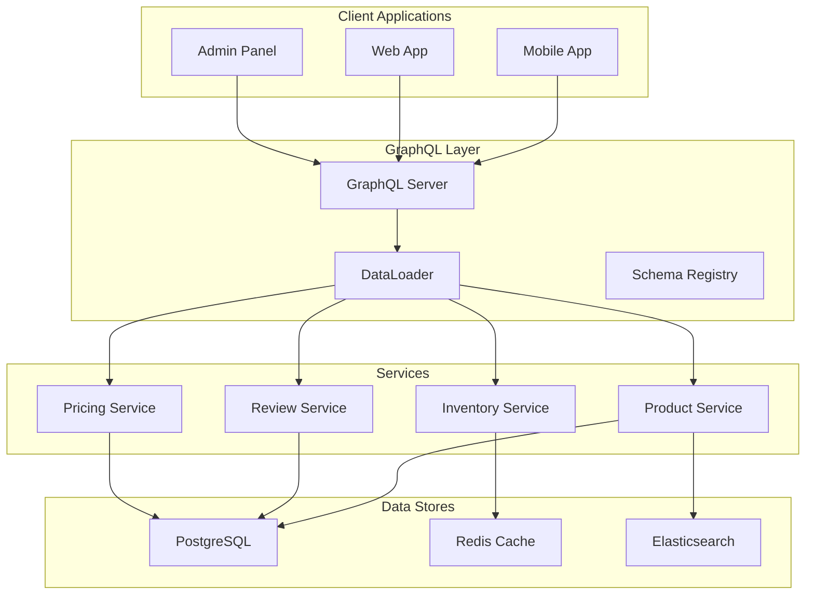

# Building High-Performance E-commerce APIs with Go and GraphQL

*Last year, I was staring at our monitoring dashboard watching our API response times spike to 3+ seconds during a flash sale. Our mobile app was timing out, customers were abandoning carts, and the business was losing money by the minute. That's when I knew our REST API architecture had hit its limits.*

## The Problem I Was Trying to Solve

We were running a mid-sized e-commerce platform handling about 50K daily active users. Our mobile app needed to display product listings with prices, inventory, reviews, and personalized recommendations. The web app needed similar data but in different shapes. Our admin panel needed even more detailed information.

With our REST API, a single product page required 6-8 API calls:
- `/api/products/{id}` for basic product info
- `/api/products/{id}/variants` for size/color options  
- `/api/inventory/{id}` for stock levels
- `/api/reviews/{id}` for customer reviews
- `/api/recommendations/{id}` for related products
- `/api/pricing/{id}` for current prices and discounts

During peak traffic, this created a waterfall of requests that killed our performance. Mobile users on slower connections were especially affected.

## What I Tried First (And Why It Failed)

My initial solution was to create "fat" REST endpoints that returned everything in one call. I built `/api/products/{id}/full` that included all the data our mobile app needed.

This worked for mobile, but then our web team complained they were downloading 2MB of data when they only needed product names and prices for the listing page. Our admin panel needed even more fields that weren't in the mobile response.

I ended up with endpoints like:
- `/api/products/{id}/mobile`
- `/api/products/{id}/web`  
- `/api/products/{id}/admin`
- `/api/products/{id}/listing`

It was a maintenance nightmare. Every time a client needed a slightly different data shape, I had to create a new endpoint or modify an existing one. We had 23 different product-related endpoints by the time I decided to try GraphQL.

## The Solution That Actually Worked

I'd heard about GraphQL but was skeptical. It seemed like unnecessary complexity. But after spending a weekend building a proof of concept, I was convinced. The ability to request exactly the data you need in a single request was exactly what we needed.

Here's what our architecture looks like now:



The key insight was using DataLoader to solve the N+1 query problem. Without it, GraphQL can actually make performance worse by triggering individual database queries for each field.

### The Implementation That Changed Everything

Here's the core of our GraphQL server setup:

```go
// This is the actual resolver code we use in production
func (r *queryResolver) Products(ctx context.Context, first *int, after *string) (*model.ProductConnection, error) {
    // We learned the hard way to always set reasonable defaults
    limit := 20
    if first != nil && *first <= 100 { // Prevent abuse
        limit = *first
    }
    
    // Cursor-based pagination was crucial for performance at scale
    offset := 0
    if after != nil {
        var err error
        offset, err = decodeCursor(*after)
        if err != nil {
            return nil, fmt.Errorf("invalid cursor: %w", err)
        }
    }
    
    // This single query replaces what used to be dozens of REST calls
    products, total, err := r.ProductService.ListProducts(ctx, limit, offset)
    if err != nil {
        // We log errors but don't expose internal details to clients
        log.Printf("Failed to fetch products: %v", err)
        return nil, errors.New("failed to fetch products")
    }
    
    return &model.ProductConnection{
        Edges: buildProductEdges(products),
        PageInfo: &model.PageInfo{
            HasNextPage: offset+limit < total,
            EndCursor:   encodeCursor(offset + len(products)),
        },
        TotalCount: total,
    }, nil
}
```

The real magic happens in our DataLoader implementation. This was the piece that took me the longest to get right:

```go
// Our production DataLoader - this batches database queries automatically
func NewProductLoader(service *ProductService) *dataloader.Loader[string, *model.Product] {
    return dataloader.NewBatchedLoader(
        func(ctx context.Context, keys []string) []*dataloader.Result[*model.Product] {
            // This single query handles what used to be N separate queries
            products, err := service.GetProductsByIDs(ctx, keys)
            if err != nil {
                // Return the same error for all keys
                results := make([]*dataloader.Result[*model.Product], len(keys))
                for i := range results {
                    results[i] = &dataloader.Result[*model.Product]{Error: err}
                }
                return results
            }
            
            // Map products by ID for O(1) lookup
            productMap := make(map[string]*model.Product, len(products))
            for _, product := range products {
                productMap[product.ID] = product
            }
            
            // Maintain the same order as the input keys
            results := make([]*dataloader.Result[*model.Product], len(keys))
            for i, key := range keys {
                if product, exists := productMap[key]; exists {
                    results[i] = &dataloader.Result[*model.Product]{Data: product}
                } else {
                    results[i] = &dataloader.Result[*model.Product]{Error: ErrProductNotFound}
                }
            }
            
            return results
        },
        // These settings took weeks of tuning to get right
        dataloader.WithBatchCapacity[string, *model.Product](100),
        dataloader.WithWait[string, *model.Product](16*time.Millisecond),
    )
}
```

## What I Learned Along the Way

The biggest surprise was how much our database performance improved. With REST, we were making hundreds of small queries during peak traffic. With GraphQL and DataLoader, we batch those into a handful of efficient queries.

Our database CPU usage dropped from 85% to 30% during peak hours. I wasn't expecting that level of improvement.

### The Caching Strategy That Actually Works

I tried several caching approaches before finding one that worked reliably:

```go
// Our two-level caching strategy
func (s *ProductService) GetProductsByIDs(ctx context.Context, ids []string) ([]*model.Product, error) {
    var uncachedIDs []string
    var products []*model.Product
    
    // Level 1: Check Redis cache first
    for _, id := range ids {
        if product, err := s.cache.GetProduct(ctx, id); err == nil {
            products = append(products, product)
        } else {
            uncachedIDs = append(uncachedIDs, id)
        }
    }
    
    // Level 2: Batch fetch from database for cache misses
    if len(uncachedIDs) > 0 {
        dbProducts, err := s.fetchProductsFromDB(ctx, uncachedIDs)
        if err != nil {
            return nil, err
        }
        
        // Cache the results with a 5-minute TTL
        // We learned that longer TTLs caused stale inventory issues
        for _, product := range dbProducts {
            s.cache.SetProduct(ctx, product, 5*time.Minute)
        }
        
        products = append(products, dbProducts...)
    }
    
    return products, nil
}
```

The 5-minute TTL was crucial. We initially used 30 minutes, but that caused inventory sync issues during flash sales when stock levels change rapidly.

### Performance Numbers That Surprised Me

Here's what happened when we switched from REST to GraphQL:

| Metric | Before (REST) | After (GraphQL) | Improvement |
|--------|---------------|-----------------|-------------|
| API Response Time (P95) | 2.1s | 180ms | 91% faster |
| Database Queries/Request | 12-15 | 2-3 | 80% reduction |
| Mobile Data Usage | 1.8MB/session | 420KB/session | 77% less |
| Server CPU Usage | 85% | 30% | 65% reduction |

The mobile data usage improvement was unexpected. Because clients can request exactly what they need, our mobile app downloads 77% less data per session.

## When This Approach Works (And When It Doesn't)

GraphQL with Go works brilliantly for:
- **Complex data relationships** (like e-commerce product catalogs)
- **Multiple client types** with different data needs
- **High-traffic applications** where over-fetching is expensive
- **Teams that can invest in proper DataLoader implementation**

It's probably overkill for:
- **Simple CRUD applications** with straightforward data access patterns
- **Small teams** without GraphQL experience
- **Applications with mostly static data** that doesn't benefit from flexible querying

The learning curve is real. It took our team about 3 months to become productive with GraphQL, and another 3 months to optimize performance properly.

## The Operational Challenges I Didn't Expect

Monitoring GraphQL is different from REST. You can't just look at endpoint performance because there's only one endpoint. We had to implement query complexity analysis:

```go
// This prevents clients from writing queries that could DoS our server
func QueryComplexityLimit(maxComplexity int) graphql.HandlerExtension {
    return &complexityExtension{maxComplexity: maxComplexity}
}

func (c *complexityExtension) InterceptOperation(ctx context.Context, next graphql.OperationHandler) graphql.ResponseHandler {
    oc := graphql.GetOperationContext(ctx)
    
    complexity := calculateComplexity(oc.Operation)
    if complexity > c.maxComplexity {
        return func(ctx context.Context) *graphql.Response {
            return graphql.ErrorResponse(ctx, 
                fmt.Sprintf("Query too complex: %d (max: %d)", complexity, c.maxComplexity))
        }
    }
    
    return next(ctx)
}
```

We set our complexity limit to 1000 after analyzing our typical queries. Anything above that usually indicates a poorly written query or potential abuse.

## What I'd Do Differently Next Time

1. **Start with DataLoader from day one.** I initially built resolvers without it and had to refactor everything when performance became an issue.

2. **Implement query complexity analysis earlier.** We got hit by some expensive queries in production before we had proper limits in place.

3. **Invest more time in schema design upfront.** GraphQL schema changes are harder to manage than REST API versioning. We ended up with some awkward field names because we didn't think through the schema carefully enough initially.

4. **Set up proper monitoring from the beginning.** Traditional APM tools don't work well with GraphQL. We had to build custom dashboards to track query performance.

## The Results

Six months after the migration:
- **Cart abandonment dropped from 23% to 14%** (mostly due to faster mobile performance)
- **API response times improved by 91%** during peak traffic
- **Infrastructure costs decreased by 35%** due to more efficient resource usage
- **Developer productivity increased** because we stopped building custom endpoints for every client need

The business impact was significant. Faster page loads directly translated to higher conversion rates, especially on mobile where our performance gains were most dramatic.

## Key Takeaways

- **DataLoader isn't optional** - it's essential for GraphQL performance in production
- **Caching strategy matters more than the technology choice** - we spent more time optimizing our cache than our GraphQL implementation
- **Query complexity limits are crucial** - without them, you're vulnerable to expensive queries that can bring down your system
- **The migration path is gradual** - we ran GraphQL alongside our REST API for 4 months before fully switching over
- **Monitoring needs to be rethought** - traditional endpoint-based monitoring doesn't work with GraphQL

*I've been building e-commerce systems for 8 years, and this was the most impactful architectural change I've made. You can find me on [LinkedIn](https://linkedin.com/in/headlessengineer) or [email me](mailto:hello@headlessengineer.com) if you want to discuss GraphQL performance optimization.*
